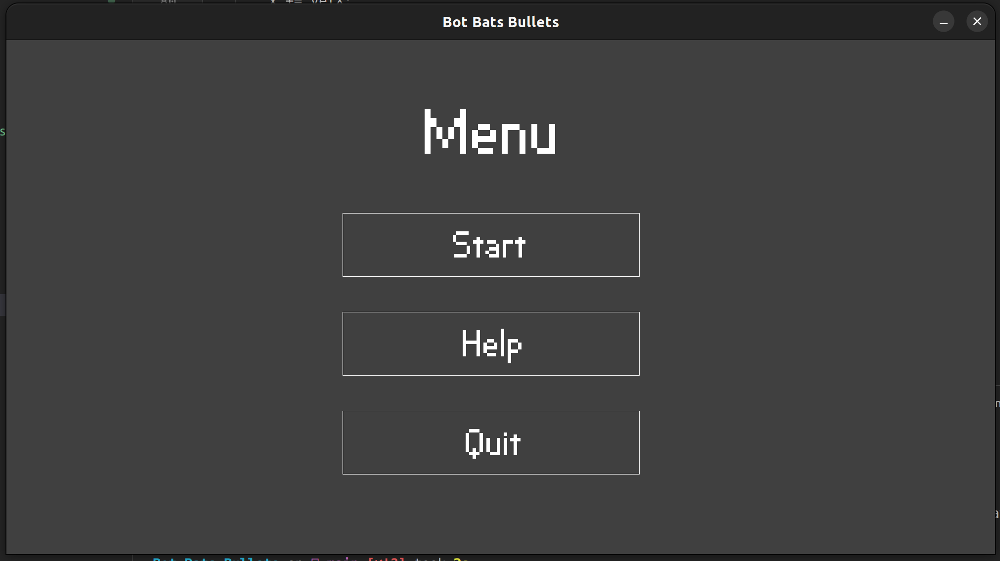
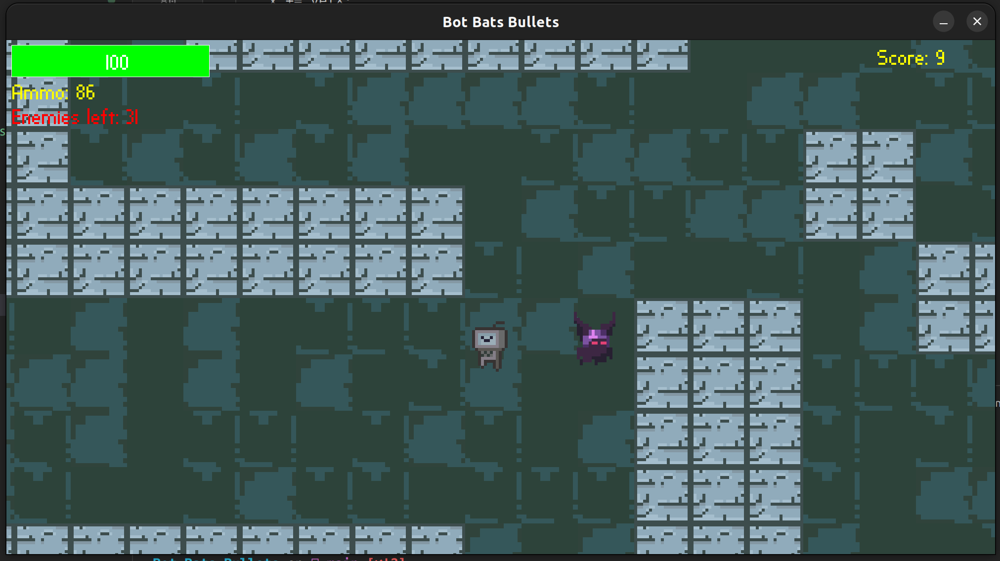
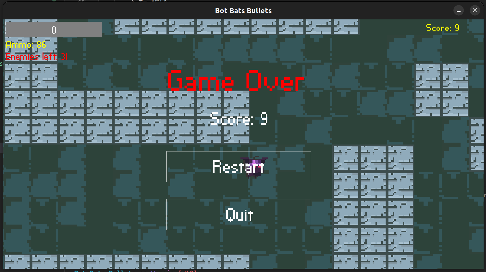

# Bots Bats Bullets - Top Down Shooter
This is a personal project done to improve understanding of Java and Object Oriented developement. 

## Features:
- Main menu

- Help menu
- Pausing
- Resolution scaling
- Map loading (just add your own map in the dedicated folder)

- Score system (local - not stored)

## Installation
Uses Java 17, run Main.java artifacts are included (for now, will need to clean up more)

# Future plans
1. Performance imropvement - currently the game runs on a single thread, and does not preload textures, so tackling those two issues would be preferable.
2. Simplify collision system for the enemies.
3. Improve enemies AI - currently enemies either randomly roam around the map or follow the player once they get close.
4. Procedural level generation.
